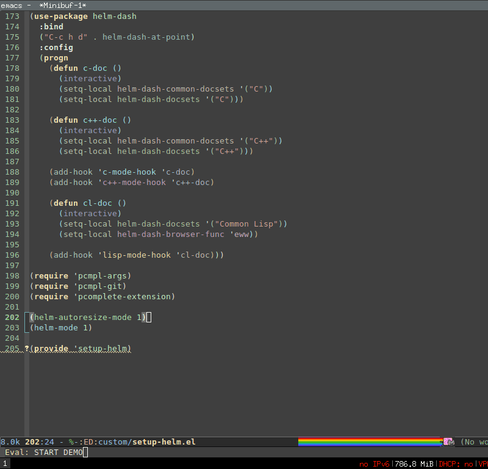

Emacs-helm [](https://www.paypal.com/cgi-bin/webscr?cmd=_donations&business=thierry.volpiatto@gmail.com&lc=US&currency_code=EUR&bn=PP-DonationsBF:btn_donateCC_LG.gif:NonHosted)
=========================


```
 _____                            _   _      _
| ____|_ __ ___   __ _  ___ ___  | | | | ___| |_ __ ___
|  _| | '_ ` _ \ / _` |/ __/ __| | |_| |/ _ \ | '_ ` _ \
| |___| | | | | | (_| | (__\__ \ |  _  |  __/ | | | | | |
|_____|_| |_| |_|\__,_|\___|___/ |_| |_|\___|_|_| |_| |_|
```

## Abstract

`Helm` is incremental completion and selection narrowing framework for
Emacs. It will help steer you in the right direction when you're looking
for stuff in Emacs (like buffers, files, etc).

Helm is a fork of `anything.el` originaly written by Tamas Patrovic
and can be considered to be its successor. 
`Helm` sets out to clean up the legacy code in `anything.el`
and provide a cleaner, leaner and more modular tool, that's not tied in
the trap of backward compatibility. 

## Requirements

You need a recent Emacs to use latest helm, at least Emacs-24.3.

[async](https://github.com/jwiegley/emacs-async) will be installed as dependency
when installing from melpa but is facultative when installing from git (recommended though
as it may fix installation of all packages from (m)elpa and will allow you to
copy/rename asynchronously your files from helm and/or dired if needed).

## Getting Started

### Quick install from git

  1. Clone the `helm` repository to some directory:
  
    ```elisp
    $ git clone https://github.com/emacs-helm/helm.git /path/to/helm/directory
    ```

  2. Clone the `async` repository to some directory (facultative)

    ```elisp
    $ git clone git@github.com:jwiegley/emacs-async.git /path/to/async/directory
    ```
  3. Run `make` from the `helm` directory.
  
  3. Add to `.emacs.el` (or equivalent):

    ```elisp
    ;; [Facultative] Only if you have installed async.
    (add-to-list 'load-path "/path/to/async/directory")
    
    (add-to-list 'load-path "/path/to/helm/directory")
    (require 'helm-config)
    ```
    
_NOTE:_ Installing helm like this (i.e from git+make) is the safest way.

You can have a quick try to `helm` by launching from the helm directory:

`./emacs-helm.sh`

It is also recommended to use this when reporting bug.

_NOTE:_ That this will not work on Windows systems.

### Install from Emacs packaging system

Helm is now available on Melpa at http://melpa.org/
You will find there instructions to install.
See also https://github.com/milkypostman/melpa#usage to startup correctly
with the emacs packaging system.
Then you should need only in your init file:

```elisp
(require 'helm-config)
```

_WARNING:_ Due to a bad concept of package.el which is in charge of fetching helm files
and compiling them, users had errors most of the time when upgrading from melpa and `list-package`.
To avoid this [Async](https://github.com/jwiegley/emacs-async) have been added as dependency to
helm to force package.el compiling its files in a clean environment.
People installing from git and using the make file will not suffer from this problem and don't need
[Async](https://github.com/jwiegley/emacs-async) though it is recommended as it fix installation
of all other packages you may install with package.el from (m)elpa.
See [FAQ](https://github.com/emacs-helm/helm/wiki#faq) for more infos.

_Note:_ After upgrading from the emacs packaging system you should restart emacs for the changes take effect.

**Note to Linux Distributions Maintainers**

`Only the extensions present in the github emacs-helm organisation are supported.`

### Alternate install warning

Some people are installing `helm` with their own config using diverses `require`, `autoload`
and other hacks, not using `helm-config`.
Expect failures and slowdown at startup unless you really know what you are doing when you do so.

### Emacs Prelude

If you're afraid to play with Emacs's configuration, but want to try
out Helm - have NO FEAR. Have a look at
[Emacs Prelude](https://github.com/bbatsov/prelude) - it has
Helm built-in and properly set-up.

For a minimal helm configuration, run `./emacs-helm.sh` and look at the file
`/tmp/helm-cfg.el`.

### Basic usage

Just type `M-x helm-M-x RET helm-`, you will have completion on all helm commands.

You can bind this to `M-x` like this:

`(global-set-key (kbd "M-x") 'helm-M-x)`

- _IMPORTANT:_

Once you are in the helm session (of `helm-M-x` or any one else) you can hit either `C-h m` or
`C-c ?`, the former is will popup a general info buffer about helm while the second will
popup a specialized info of the current source you are into.
Sometime `C-c ?` is not available, in this case you will see in mode-line `C-h m` instead of `C-c ?`.
PLEASE USE and ABUSE of these `helm` embeded infos before reporting a bug about how to do things
in `helm`, you will find also useful infos in mode-line.

You can also start with `M-x helm-mode` and enjoy helm completion in your favourites
Emacs commands (e.g `M-x`, `C-x C-f`, etc...).
You can enable this by adding in your init file:

```elisp
(helm-mode 1)
```

- _NOTE_ that the helmized emacs commands are different and much more basics than the helm ones.

As a startup point you can also look at the helm section in Emacs menu to
discover some of the commands provided by helm.

For those who have a system able to run shell scripts, a convenient way to discover helm
is to run `./emacs-helm.sh` from the helm directory, you will find interesting infos in
your scratch buffer.
`emacs-helm.sh` accept all emacs command line options, see `emacs-helm.sh -h` for more
infos.

### Advanced usage

Helm is capable of a lot. Here is a demo of `helm-buffers-list`:


The demo starts when you see `Eval: START` in the minibuffer.

- All the C buffers are selected using the regexp `*C`. In the demo, I also select Tcl buffers with `*Tcl` and then switched back to C buffers with `*C`.
- I only want to have buffers that contains only the string "crash". To do that, I add a space, then add the pattern `@crash`.
- After the initial search pattern, I hand over the current matching buffers to `helm-moccur` - `moccur` with Helm interface. In the above demo, I only switch to one file, that is `kexec.c`. However, you can select multiple buffers with `C-SPC` or select all buffers with `M-a`.
- Candidates can be filtered gradually by adding more pattern, i.e. I added `memory` to filtered down to buffers that contain the string "memory" among the buffers that are containing "crash".

As you can see, as you filtered out, the number of candidates decreases, as displayed in the modeline. At the end, there were 12 buffers remained as the result of filtering, down from the total 253 buffers.

You can read [this guide](http://tuhdo.github.io/helm-intro.html) to quickly get started with Helm.

You can find all the gory details on the [Helm Wiki](https://github.com/emacs-helm/helm/wiki).

#### Fuzzy matching

Helm has a built-in fuzzy matcher that is activated for some commands. Fuzzy matching is disabled by default. Currently these commands supports fuzzy matching:

- `helm-recentf`: Enabled by setting `helm-recentf-fuzzy-match` to `t`.
- `helm-mini`: Enable by setting `helm-buffers-fuzzy-matching` and `helm-recentf-fuzzy-match` to `t`.
- `helm-buffers-list`: Enable by setting `helm-buffers-fuzzy-matching` to `t`.
- `helm-find-files`: Enabled by default.
- `helm-locate`: Enable by setting `helm-locate-fuzzy-match` to `t`.
- `helm-M-x`: Enabled by setting `helm-M-x-fuzzy-match` to `t`.
- `helm-semantic`: Enabled by setting `helm-semantic-fuzzy-match` to `t`.
- `helm-imenu`: Enabled by setting `helm-imenu-fuzzy-match` to `t`.
- `helm-apropos`: Enabled by setting `helm-apropos-fuzzy-match` to `t`.
- `helm-lisp-completion-at-point`: Enabled by setting `helm-lisp-fuzzy-completion` to `t`.

**IMPORTANT**: To make fuzzy-matching fast, you must not set `helm-candidate-number-limit` to high. It is recommended that you leave variable with its default value 100. The higher you set `helm-candidate-number-limit`, the slower fuzzy-matching.

#### Autoresize

Helm can now resize according to the number of candidates with `helm-autoresize-mode`:

    (helm-autoresize-mode 1)

Here is a demo:



You can customize the minimum and maximum height that Helm can resize with these two variable:

- `helm-autoresize-max-height`
- `helm-autoresize-min-height`

By default, `helm-autoresize-max-height` is set to 40, which makes Helm candidate buffer has the maximum height of 40% of current frame height. Similarly, `helm-autoresize-min-height` specifies the minimum height that Helm candidate buffer cannot be smaller.

If you don't want the Helm window to be resized, but a smaller Helm window, you can set `helm-autoresize-max-height` equal to `helm-autoresize-max-height`.

## Known issues

Check out the project's
[issue list](https://github.com/emacs-helm/helm/issues?sort=created&direction=desc&state=open)
a list of unresolved issues. By the way - feel free to fix any of them
and sent us a pull request. :-)

## Contributors

Here's a [list](https://github.com/emacs-helm/helm/contributors) of all the people who have contributed to the
development of Helm.

## Bugs & Improvements

Bug reports and suggestions for improvements are always
welcome, be sure though they are related to helm, many bugs are coming from emacs itself
or other packages. GitHub pull requests are even better! :-)

NOTE: When trying if something is working or not, be sure to start helm from `Emacs -Q` or even better
Start it from your helm directory with `./emacs-helm.sh`.

## Getting help

If [Helm Wiki](https://github.com/emacs-helm/helm/wiki) is not enough, you can ask for help
on [emacs-helm google group](https://groups.google.com/group/emacs-helm?hl=en).


Cheers,<br>
The Helm Team

