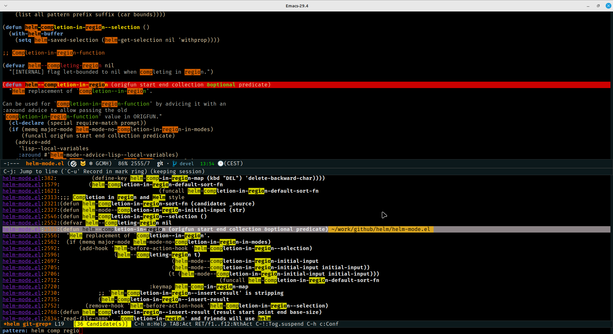

<p align="center"><a href="http://www.gnu.org/licenses/gpl-3.0.txt"></a>
  <a href="https://melpa.org/#/helm"></a>
  <a href="https://stable.melpa.org/#/helm"></a>
</p>


<h1 align="center">Emacs-helm</h1>

<p align="center">
    
</p>

***
<p align="justify">
  <b>Helm</b> is an Emacs framework for incremental completions and narrowing
  selections. It helps to rapidly complete file names, buffer names, or
  any other Emacs interactions requiring selecting an item from a list of
  possible choices.
  Helm is a fork of <b>anything.el</b>, which was originally written by Tamas
  Patrovic and can be considered to be its successor. <b>Helm</b> cleans the
  legacy code that is leaner, modular, and unchained from constraints of
  backward compatibility.
</p>

***

<p align="center">
  <a href="https://github.com/emacs-helm/helm/wiki"><b>Helm wiki</b></a> |
  <a href="https://github.com/emacs-helm/helm/wiki/FAQ"><b>FAQ</b></a>
</p>

***
<!-- markdown-toc start - Don't edit this section. Run M-x markdown-toc-refresh-toc -->
**Table of Contents**

- [Introduction](#introduction)
- [Features](#features)
- [Alternatives](#alternatives)
- [Requirements](#requirements)
- [Getting Started](#getting-started)
    - [Install from [Straight](https://github.com/raxod502/straight.el)](#install-from-straighthttpsgithubcomraxod502straightel)
    - [Quick install from git](#quick-install-from-git)
    - [Install from Emacs packaging system](#install-from-emacs-packaging-system)
    - [Installing just the helm-core package](#installing-just-the-helm-core-package)
    - [Warning about alternate installation methods](#warning-about-alternate-installation-methods)
    - [Configuration](#configuration)
    - [General recommandations](#general-recommandations)
    - [Basic usage](#basic-usage)
        - [Windows and frames configuration](#windows-and-frames-configuration)
        - [Matching methods](#matching-methods)
        - [Creating custom helm sources](#creating-custom-helm-sources)
- [Helm Applications](#helm-applications)
- [Recommended Helm extensions](#recommended-helm-extensions)
- [Other emacs extensions recommended with helm](#other-emacs-extensions-recommended-with-helm)
- [External programs recommended with helm](#external-programs-recommended-with-helm)
- [Known issues](#known-issues)
- [Contributors](#contributors)
- [Bugs & Improvements](#bugs--improvements)
- [Getting help](#getting-help)

<!-- markdown-toc end -->

# Introduction

`Helm` is an Emacs framework for incremental completions and narrowing
selections. It helps to rapidly complete file names, buffer names, or
any other Emacs interactions requiring selecting an item from a list of
possible choices.

Helm is a fork of `anything.el`, which was originally written by Tamas
Patrovic and can be considered to be its successor. `Helm` cleans the
legacy code that is leaner, modular, and unchained from constraints of
backward compatibility.



# Features

In addition of its framework where you can build your own `Helm`
applications, `Helm` provides preconfigured commands to browse and
search incrementally in files, buffers, bookmarks etc... and much
more.  Helm allows displaying different sources in same session.  Helm
displays its candidates in a window or a frame, keeping the minibuffer for
user input.  Helm provides a full set of actions for each of its
sources, each action apply on a single candidate or a set of marked
candidates.

_Note:_ You will find many helm extensions providing diverse features sometimes already implemented in `Helm`, 
prefer generally the ones that are natively in `Helm`, e.g. `Helm` support natively most grep implementations as backend (ack, ag, rg),
no need to install 3rd party packages for this, same for managing projects etc...

# Alternatives

There are several alternatives to Helm nowaday, they are all providing
incremental completion but they lack all the Helm features due to
their wrong implementation abusing minibuffer.

# Requirements

Helm requires Emacs-25.1 or later versions.

Helm installs [async](https://github.com/jwiegley/emacs-async) and [popup-el](https://github.com/auto-complete/popup-el) package as dependencies
when Helm is installed using [MELPA](https://melpa.org/). 

# Getting Started

## Install from [Straight](https://github.com/raxod502/straight.el)

See [Install from straight package manager](https://github.com/emacs-helm/helm/wiki#from-straight-package-manager)

## Quick install from git

See [Install Helm from Git](https://github.com/emacs-helm/helm/wiki#from-source)

_NOTE:_ Installing helm using git and make is the safest way.

## Install from Emacs packaging system

See [Install Helm from Melpa](https://github.com/emacs-helm/helm/wiki#from-melpa)

_NOTE:_ This is not the recommended way to install packages.

## Installing just the helm-core package

`helm-core` package is available on [MELPA](https://melpa.org/) for
third party packages that depend on helm libraries. These packages
should require helm as follows:

     (require 'helm)

Requiring helm builds and runs helm code necessary for multiple regexp
and fuzzy matching. See
[helm wiki](https://github.com/emacs-helm/helm/wiki#developpingusinghelmframework)
for details.

## Warning about alternate installation methods
    
Installation methods that circumvent `helm-config` are known to fail
if the careful safeguards are not implemented in the hacks. 

## Configuration

For minimal helm configuration, run the start-up script `./emacs-helm.sh`
and then see the file `/tmp/helm-cfg.el`.

The full configuration I (the helm maintainer) use is
[here](https://github.com/thierryvolpiatto/emacs-config/blob/master/init-helm.el).

Also see helm customizable variables with the customize interface.

Enabling `helm-mode` will enable helm for many features of emacs
requiring completions, see below how to enable `helm-mode`.

## General recommandations

- When you have problems like Helm beeing slow or something not working, always fallback to default settings.

- Configure Helm yourself, don't use preconfigured Emacs that configure wrongly Helm for you.

- Refrain installing all Helm packages you find in Melpa, check first if the feature you are looking for is available in Helm.

- Nowaday, there is dozen of completion UI available for Emacs, refrain using many of those in addition with Helm unless you know what you are doing.


## Basic usage

`M-x helm-M-x RET helm-` lists helm commands ready for narrowing and selecting.

To bind to `M-x`: 

`(global-set-key (kbd "M-x") 'helm-M-x)`

- _IMPORTANT:_

In any helm session,

`C-h m` pops an org buffer with detailed documentation about current command and more generalized infos about helm.

Use it with no moderation!

Use these embedded Info screens first before reporting bugs.

`M-x helm-mode` to enable helm completion for common Emacs
commands. Note that the helm functionality enabled through helm-mode
comes from a generic implementation and does not include all helm
features available through equivalent helm-specific commands.
See [FAQ](https://github.com/emacs-helm/helm/wiki/FAQ#why-after-enabling-helm-mode-m-x-and-c-x-c-f-are-not-helmized)
about `M-x` and `C-x C-f`.

To make helm-mode start with Emacs init file: 

```elisp
(helm-mode 1)
```
NOTE: `helm-mode` is using Emacs `completion-styles` by default, you may want to configure your `completion-styles` for a better experience.
The recommended setting is to use `(setq completion-styles '(flex))` if flex is available in your Emacs (27+ only) otherwhise use the helm-flex style (emacs-26).

To discover basic helm commands, look at helm menu item in Emacs menu. 

Another way to discover helm commands: run the shell script:
`./emacs-helm.sh` from helm directory and then look in the scratch
buffer. `emacs-helm.sh` accepts emacs command line
options. `emacs-helm.sh -h` opens an Info screen with more details.

_Note:_ When helm is installed with "make install" 
you will have a shell command named helm that you can run from any
places i.e. not only from the helm directory

See https://github.com/emacs-helm/helm/wiki#quick-try-with-emacs-helmsh

### Windows and frames configuration

Helm allows displaying its candidates in several ways, side windows, frames, one window etc...
You will find the documentation with `C-h m` as usual or on wiki, use as well `C-h c` to see the relevant variables you can set.
Here helm started from emacs-helm.sh script and displaying its candidates in a separate frame:


### Matching methods

Helm support by default multi pattern matching, it is the standard way
of matching in helm.
E.g You can use a pattern like "foo bar" to match a line containing "foo" and "bar"
or "bar" and "foo".
Each pattern can be a regexp.

In addition helm support [fuzzy matching](https://github.com/emacs-helm/helm/wiki/Fuzzy-matching).

### Creating custom helm sources

An example:

```elisp

(helm :sources (helm-build-sync-source "test"
                 :candidates '(foo foa fob bar baz)
                 :fuzzy-match t)
      :buffer "*helm test*")
```

The candidates list may be replaced by a function that produces a list.
See ([helm wiki](https://github.com/emacs-helm/helm/wiki#25-developing-using-helm-framework))
for details.

# Helm Applications 

These are popular applications developed using helm completion and
narrowing framework. They are available for individual installs
through the Emacs package manager. This list is not exhaustive.

- `helm-mode`: turns on helm completions for most standard emacs
  completions. Helm provides even more optimized helm completions for
  some commands in helm-mode. Prefer these natively optimized versions
  over the ones in helm-mode.
  
- `helm-find-files`: one command that handles all the files related
  commands (bind to `C-x C-f`).
  
- `helm-buffers-list`: provides enhanced buffers listing.

- `helm-browse-project`: handles project files and buffers; defaults
   to current directory; works with `helm-find-files`; recommended
   with [helm-ls-git](https://github.com/emacs-helm/helm-ls-git),
   [helm-ls-hg](https://github.com/emacs-helm/helm-ls-hg) and
   `helm-ls-svn` for a better handling of version control files.
   Each time a project under version control is visited it is added
   to `helm-browse-project-history` and can be visted with `helm-projects-history`.
   
- `helm-dabbrev`: enhanced dabbrev implementation with helm
  completion; does not use emacs code.
  
- `helm-occur`: enhanced occur for one or more buffers; launch from
  `helm-buffers-list` or `current-buffer`.
  
- `helm-M-x`: enhanced `execute-extended-command` (bind it to `M-x`).

- `helm-imenu` and `helm-imenu-in-all-buffers`: provide imenus for
  current or all buffers.
  
- `helm-etags-select`: enhanced etags with helm-completion; usable
  everywhere with `helm-find-files`.
  
- `helm-apropos`: enhanced apropos for functions and variables that
  `C-h` commands provide.
  
- `Grep`: launch from any helm file commands; supports back-ends
  `grep`, `ack-grep`, `git-grep`, `ag` and custom implementation of
  `pt`.
  
- `helm-gid`: Helm interface for `gid` from
  [id-utils](https://www.gnu.org/software/idutils/).
  
- `helm-show-kill-ring`: A helm browser for kill ring.

- `helm-all-mark-rings`: A helm browser for mark ring; retrieves last positions in buffers.

- `helm-filtered-bookmarks`: enhanced browser for bookmarks.

- `helm-list-elisp-packages`: enhanced browser for elisp package management.

# Recommended Helm extensions

Normally all Helm modules coming from [Emacs-helm](https://github.com/emacs-helm) organisation 
are safe to use otherwise it is mentioned in their README if they are broken or unmaintained.
Here some of them I am using:

- [helm-ls-git](https://github.com/emacs-helm/helm-ls-git)
- [helm-addressbook](https://github.com/emacs-helm/helm-addressbook)
- [helm-dictionary](https://github.com/emacs-helm/helm-dictionary)
- [helm-mu](https://github.com/emacs-helm/helm-mu)
- [helm-slime](https://github.com/emacs-helm/helm-slime)
- [helm-system-packages](https://github.com/emacs-helm/helm-system-packages)
- [helm-descbinds](https://github.com/emacs-helm/helm-descbinds)
- [helm-firefox](https://github.com/emacs-helm/helm-firefox)
- [helm-w3m](https://github.com/emacs-helm/helm-w3m)
- [helm-emms](https://github.com/emacs-helm/helm-emms)

**Warning** Helm development has sparked quite a few extensions, many
of which duplicate features already included in helm. Some of these
packages (about 20 at last count in the MELPA repository) are either
deprecated or unmaintained. Moreover, many remain out-of-sync with
`helm` core development cycles causing incompatibilities. To avoid
helm problems or unstable emacs, please look for comparable features
within [helm](https://github.com/emacs-helm/helm) and
[emacs-helm](https://github.com/emacs-helm) before installing such
extensions e.g. helm-swoop vs helm-occur which is part of Helm.

# Other emacs extensions recommended with helm

- [Emacs-wgrep](https://github.com/mhayashi1120/Emacs-wgrep)

# External programs recommended with helm

- [Ripgrep](https://github.com/BurntSushi/ripgrep)

# Known issues

The Helm project has a current unresolved 
[issue list](https://github.com/emacs-helm/helm/issues?sort=created&direction=desc&state=open).
Please feel free to fix any of them; send a pull request.

Most issues come from a wrong configuration or a use of Helm modified externally by third party package e.g. Spacemacs.
Some other Helm packages that are no more maintained (or badly maintained) and use deprecated Helm code will clash also with recent Helm
be aware.

# Contributors

The Helm project maintains a
[list](https://github.com/emacs-helm/helm/contributors) of
contributors.

# Bugs & Improvements

The Helm Team welcomes bug reports and suggestions. Note that not all
bugs when using Helm are due to Helm. Because of the way Helm
interacts with many Emacs features, bugs may be related to Emacs
itself.

One way to ascertain that the bugs are helm-related, recreate the
error either by using `Emacs -Q` or by running the included package
script `./emacs-helm.sh` located in the helm directory.

Helm comes now with a template for filling bugs, when reporting issues,
be sure to fill all sections and to run helm from a minimal install as
described above to reproduce your bug.

# Getting help

[Helm Wiki](https://github.com/emacs-helm/helm/wiki)

Or ask directly on github issues.

Cheers,<br>
The Helm Team

[badge-license]: https://img.shields.io/badge/license-GPL_3-green.svg
